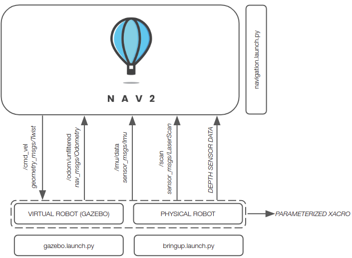
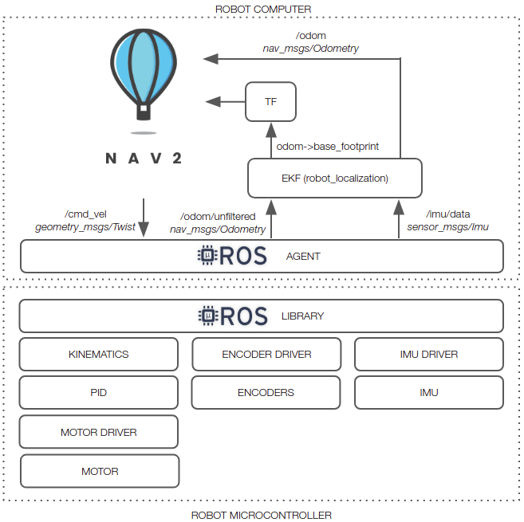

# linorobot2（中文译本）

linorobot2 是 linorobot 包的 ROS2 实现，适用于构建具有 2WD、4WD 或 Mecanum 驱动配置的定制机器人。该包提供了用于与 Nav2 集成的启动文件，并包含在 Gazebo 中完整的仿真流水线。

该软件栈对硬件无关，用户可以在启动真实机器人和在 Gazebo 中生成虚拟机器人之间切换。

如果你使用的是已测试的传感器之一，linorobot2 会自动启动必要的硬件驱动，并将话题与 Gazebo 中可用的话题一致地匹配。这允许用户为高级应用（例如 Nav2 的 SlamToolbox、AMCL）定义在真实和虚拟机器人中通用的参数。

下面的图片总结了运行 bringup.launch.py 后可用的话题。

关于如何构建机器人更详尽的教程请参阅 linorobot2_hardware（https://github.com/linorobot/linorobot2_hardware）。

## 安装

此包要求使用 ros-foxy 或 ros-galactic。如果你还没有安装 ROS2，可以使用经过 x86 和 ARM（例如 Raspberry Pi4 / Nvidia Jetson 系列）测试的安装脚本：https://github.com/linorobot/ros2me

### 1. 机器人主机 - linorobot2 包

在机器人主机上安装此包最简单的方法是运行此包根目录下的 bash 脚本。该脚本会安装所有依赖项，设置机器人的基础和传感器相关的环境变量，并在机器人主机的 $HOME 下创建 linorobot2_ws（robot_computer_ws）。如果你在 Jetson Nano 上使用 ZED 摄像头，必须为 CUDA 与 GPU 驱动创建自定义的 Ubuntu 20.04 镜像。关于如何为 Jetson Nano 创建自定义镜像的简短指南见：./ROBOT_INSTALLATION.md#1-creating-jetson-nano-image

    source /opt/ros/<ros_distro>/setup.bash
    cd /tmp
    wget https://raw.githubusercontent.com/linorobot/linorobot2/${ROS_DISTRO}/install_linorobot2.bash
    bash install_linorobot2.bash <robot_type> <laser_sensor> <depth_sensor>
    source ~/.bashrc

robot_type:
- `2wd` - 双轮驱动机器人。
- `4wd` - 四轮驱动机器人。
- `mecanum` - Mecanum 驱动机器人。

laser_sensor:
- `a1` - [RPLIDAR A1](https://www.slamtec.com/en/Lidar/A1)
- `a2` - [RPLIDAR A2](https://www.slamtec.ai/product/slamtec-rplidar-a2/)
- `a3` - [RPLIDAR A3](https://www.slamtec.ai/product/slamtec-rplidar-a3/)
- `s1` - [RPLIDAR S1](https://www.slamtec.com/en/Lidar/S1)
- `s2` - [RPLIDAR S2](https://www.slamtec.com/en/Lidar/S2)
- `s3` - [RPLIDAR S3](https://www.slamtec.com/en/Lidar/S3)
- `c1` - [RPLIDAR A3](https://www.slamtec.ai/product/slamtec-rplidar-a3/)
- `ld06` - [LD06 LIDAR](https://www.ldrobot.com/ProductDetails?sensor_name=STL-06P)
- `ld19` - [LD19/LD300 LIDAR](https://www.ldrobot.com/ProductDetails?sensor_name=STL-19P)
- `stl27l` - [STL27L LIDAR](https://www.ldrobot.com/ProductDetails?sensor_name=STL-27L)
- `ydlidar` - [YDLIDAR](https://www.ydlidar.com/lidars.html)
- `xv11` - [XV11](http://xv11hacking.rohbotics.com/mainSpace/home.html)
- `realsense` - * Intel RealSense（D435, D435i）
- `zed` - * ZED 摄像头
- `zed2` - * ZED 2
- `zed2i` - * ZED 2i
- `zedm` - * ZED Mini
- `-` - 如果机器人传感器不在上述列表中可使用 "-"。

标注星号的传感器是深度传感器。如果将深度传感器作为激光传感器使用，启动文件将运行 depthimage_to_laserscan 将深度图转换为激光扫描。

depth_sensor:
- `realsense` - Intel RealSense（D435, D435i）
- `zed` - Zed
- `zed2` - Zed 2
- `zed2i` - Zed 2i
- `zedm` - Zed Mini
- `oakd` - OAK D
- `oakdlite` - OAK D Lite
- `oakdpro` - OAK-D Pro

或者，按照 ./ROBOT_INSTALLATION.md 中的指南手动安装。

### 2. 主机/开发电脑 - Gazebo 仿真（可选）

如果你稍后计划使用 Gazebo，此步骤才需要。用于在虚拟机器人上微调参数（如 SLAM Toolbox、AMCL、Nav2）或测试应用很有帮助。

#### 2.1 在主机上安装 linorobot2 包

    cd <host_machine_ws>
    git clone -b $ROS_DISTRO https://github.com/linorobot/linorobot2 src/linorobot2
    rosdep update && rosdep install --from-path src --ignore-src -y --skip-keys microxrcedds_agent --skip-keys micro_ros_agent
    colcon build
    source install/setup.bash

* 跳过 microxrcedds_agent 和 micro_ros_agent 的依赖检查以避免出现 https://github.com/micro-ROS/micro_ros_setup/issues/138 中提到的问题。这意味着每次在安装 linorobot2 的 ROS2 工作区运行 `rosdep install` 时都需要加上 `--skip-keys microxrcedds_agent --skip-keys micro_ros_agent`。

#### 2.2 定义机器人类型

将环境变量 LINOROBOT2_BASE 设置为所用的机器人底盘类型。可用值：`2wd`、`4wd`、`mecanum`。例如：

    echo "export LINOROBOT2_BASE=2wd" >> ~/.bashrc
    source ~/.bashrc

由于本包已包含用于可视化机器人的相同 RVIZ 配置（用于远程可视化），因此可以跳过下一步（Host Machine - RVIZ 配置）。

### 3. 主机 - RVIZ 配置

安装 linorobot2_viz 包以便在远程时可视化机器人，特别是在创建地图或初始化/发送目标位姿给机器人时。该包已被拆分，以便当你不使用仿真工具时减少安装工作量。

    cd <host_machine_ws>
    git clone https://github.com/linorobot/linorobot2_viz src/linorobot2_viz
    rosdep update && rosdep install --from-path src --ignore-src -y 
    colcon build
    source install/setup.bash

## 硬件与机器人固件

所有硬件文档和机器人微控制器固件见：https://github.com/linorobot/linorobot2_hardware

## URDF

### 1. 定义机器人属性

`linorobot2_description` 包包含参数化的 xacro 文件，可帮助你开始编写机器人的 URDF。打开 linorobot2_description/urdf 中的 <robot_type>.properties.urdf.xacro 并根据机器人的规格/尺寸修改数值。所有位姿定义都必须以 `base_link`（底盘中心）为测量基准，轮子位置（例如 `wheel_pos_x`）是相对于轮 1 的位置。

对于自定义 URDF，你可以在 linorobot2_description/launch/description.launch.py 中修改 `urdf_path` 来使用自定义文件。

机器人朝向示意：

--------------FRONT--------------

WHEEL1  WHEEL2  (2WD/4WD)

WHEEL3  WHEEL4  (4WD)

--------------BACK--------------

构建机器人主机的工作区以加载新的 URDF：

    cd <robot_computer_ws>
    colcon build

如果在主机上模拟机器人，也必须在主机的 <robot_type>.properties.urdf.xacro 中做相同修改，并在修改 xacro 文件后构建主机的工作区：

    cd <host_machine_ws>
    colcon build

### 2. 可视化新建的 URDF

#### 2.1 在机器人主机上发布 URDF：

    ros2 launch linorobot2_description description.launch.py

仿真时可选参数：
- **rviz** - 将其设为 true 可以在 rviz2 中可视化机器人（仅当你在主机上配置 URDF 时）。例如：

        ros2 launch linorobot2_description description.launch.py rviz:=true

#### 2.2 在主机上远程可视化机器人：

description.launch.py 的 `rviz` 参数在无头(headless)环境下不起作用，但你可以从主机远程可视化机器人：

    ros2 launch linorobot2_viz robot_model.launch.py

## 快速入门

下面的所有命令默认在机器人主机上运行，除非你正在运行仿真或在主机上用 rviz2 可视化机器人。SLAM 与导航的启动文件对真实机器人和 Gazebo 仿真机器人是相同的。

### 1. 启动机器人

#### 1.1a 使用真实机器人：

    ros2 launch linorobot2_bringup bringup.launch.py

可选参数：
- **base_serial_port** - 机器人微控制器的串口，假定为 `/dev/ttyACM0`。如果不同，请将默认值改为正确的串口。例如：

    ros2 launch linorobot2_bringup bringup.launch.py base_serial_port:=/dev/ttyACM1

- **micro_ros_baudrate** - micro-ROS 串口波特率，默认 115200。

    ros2 launch linorobot2_bringup bringup.launch.py base_serial_port:=/dev/ttyUSB0 micro_ros_baudrate:=921600

- **micro_ros_transport** - micro-ROS 传输方式，默认 serial。
- **micro_ros_port** - micro-ROS udp/tcp 端口号，默认 8888。

    # 使用 micro-ROS wifi 传输
    ros2 launch linorobot2_bringup bringup.launch.py micro_ros_transport:=udp4 micro_ros_port:=8888

- **madgwick** - 设为 true 可启用磁力计支持。Madgwick 滤波器会融合 imu/data_raw 与 imu/mag 成 imu/data。你可以在 RVIZ2 中通过启用 IMU 与磁力计插件来可视化 IMU 与磁力计。默认 EKF 配置里只启用了 'vyaw'，如果启用磁力计，EKF 配置需要更新。IMU 与磁力计必须被校准，否则机器人的位姿会发生旋转。

    # 启用磁力计支持
    ros2 launch linorobot2_bringup bringup.launch.py madgwick:=true orientation_stddev:=0.01

    linorobot2_ws/src/linorobot2/linorobot2_base/config/ekf.yaml
        imu0: imu/data
        imu0_config: [false, false, false,
                      false, false, true,
                      false, false, false,
                      false, false, true,
                      true, true, false]

- **joy** - 设为 true 时在后台运行 joystick 节点（已在 Logitech F710 上测试）。

在运行任何应用（如创建地图或自主导航）之前，请始终等待 microROS agent 连接成功。连接后，agent 会打印：

    | Root.cpp             | create_client     | create
    | SessionManager.hpp   | establish_session | session established

agent 需要几秒钟进行重连（少于 30 秒）。如果时间异常长，请拔掉并重新插入微控制器。

#### 1.1b 使用 Gazebo：
    
    ros2 launch linorobot2_gazebo gazebo.launch.py

在真实机器人或 Gazebo 仿真中，在创建地图或运行导航前，必须在另一个终端运行 linorobot2_bringup.launch.py（真实机器人）或 gazebo.launch.py（仿真）。

### 2. 控制机器人
#### 2.1 键盘遥控
运行 teleop_twist_keyboard 来使用键盘控制机器人：

    ros2 run teleop_twist_keyboard teleop_twist_keyboard

按键说明：
- **i** - 前进
- **,** - 后退
- **j** - 逆时针旋转
- **l** - 顺时针旋转
- **shift + j** - （mecanum 机器人）向左平移
- **shift + l** - （mecanum 机器人）向右平移
- **u / o / m / .** - 组合线速度 x 与角速度 z 用于转向

#### 2.2 手柄（Joystick）
向启动文件传入 `joy:=true` 来启用手柄支持，例如：

    ros2 launch linorobot2_bringup bringup.launch.py joy:=true

对 F710 手柄：顶部开关应设为 'X' 且 'MODE' 指示灯应关闭。

按键/摇杆操作：
- **RB（右上第一个按钮）** - 按住该按钮并移动摇杆以启用控制
- **左摇杆 上/下** - 驱动机器人前进/后退
- **左摇杆 左/右** - （mecanum）机器人平移左/右
- **右摇杆 左/右** - 顺时针/逆时针旋转

### 3. 创建地图

#### 3.1 运行 SLAM Toolbox：

    ros2 launch linorobot2_navigation slam.launch.py

仿真时的可选参数：

    ros2 launch linorobot2_navigation slam.launch.py rviz:=true sim:=true

- **sim** - 在主机上仿真时设为 true，默认 false。
- **rviz** - 设为 true 在 RVIZ 中可视化，默认 false。

#### 3.1 在主机上运行 rviz2 以可视化机器人：

slam.launch.py 中的 `rviz` 参数在无头环境下不起作用，但你可以从主机远程可视化：

    ros2 launch linorobot2_viz slam.launch.py

#### 3.2 移动机器人以开始建图

手动驾驶机器人直到其覆盖操作区域的全部范围。或者，你可以在 RVIZ 中使用 "2D Goal Pose" 工具来设置自动导航目标。更多信息见：https://navigation.ros.org/tutorials/docs/navigation2_with_slam.html

#### 3.3 保存地图

    cd linorobot2/linorobot2_navigation/maps
    ros2 run nav2_map_server map_saver_cli -f <map_name> --ros-args -p save_map_timeout:=10000.

### 4. 自主导航

#### 4.1 加载你创建的地图：

打开 linorobot2/linorobot2_navigation/launch/navigation.launch.py 并将 MAP_NAME 改为新创建的地图名称。修改后构建机器人主机的工作区：

    cd <robot_computer_ws>
    colcon build

或者，启动 Nav2 时使用 `map` 参数动态加载地图文件，例如：

    ros2 launch linorobot2_navigation navigation.launch.py map:=<path_to_map_file>/<map_name>.yaml

#### 4.2 运行 Nav2：

    ros2 launch linorobot2_navigation navigation.launch.py

可选参数：
- **map** - 新创建地图的路径（<map_name.yaml>）。
- **sim** - 在主机上仿真时设为 true，默认 false。
- **rviz** - 在 RVIZ 中可视化，默认 false。

#### 4.3 在主机上运行 rviz2 可视化机器人：

navigation.launch.py 的 `rviz` 参数在无头环境下不起作用，但你可以从主机远程可视化：

    ros2 launch linorobot2_viz navigation.launch.py

注意：在初始化机器人位姿之前，navigation.launch.py 会一直抛出以下错误：

`Timed out waiting for transform from base_link to map to become available, tf error: Invalid frame ID "map" passed to canTransform argument target_frame - frame does not exist`。

## 故障排查

#### 1. 我修改的文件更改没有生效
- 每次修改文件后都需要构建工作区：

    cd <ros2_ws>
    colcon build
    # 继续你的操作...

#### 2. [`slam_toolbox]: Message Filter dropping message: frame 'laser'`
- 尝试在 linorobot2_navigation/config/slam.yaml 中将 `transform_timeout` 提高 0.1，直到警告消失。

#### 3. `target_frame - frame does not exist`
- 检查你的 <robot_type>.properties.urdf.xacro，确保没有语法错误或重复的小数点。

#### 4. 在更新 Linux/ROS 后 microROS agent 行为异常
- 别忘了在更新后也更新 microROS agent。运行：

    bash update_microros.bash

## 有用的资源

https://navigation.ros.org/setup_guides/index.html

http://gazebosim.org/tutorials/?tut=ros2_overview
